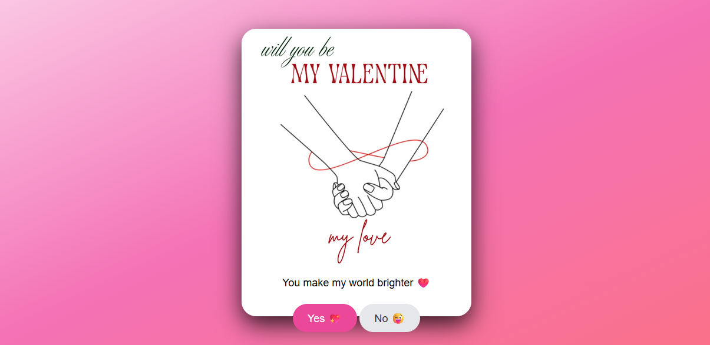
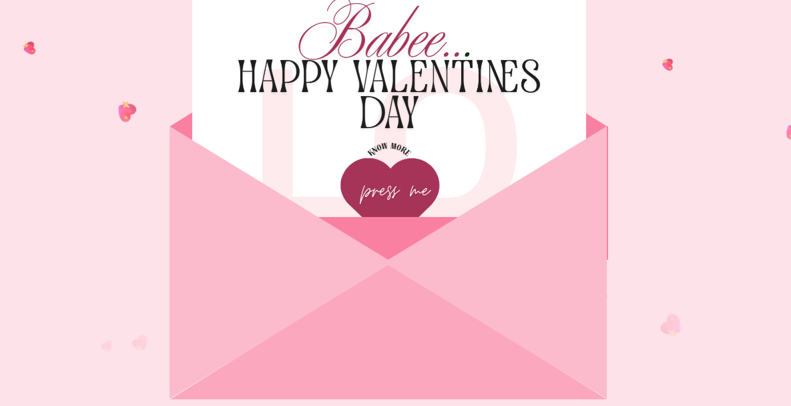
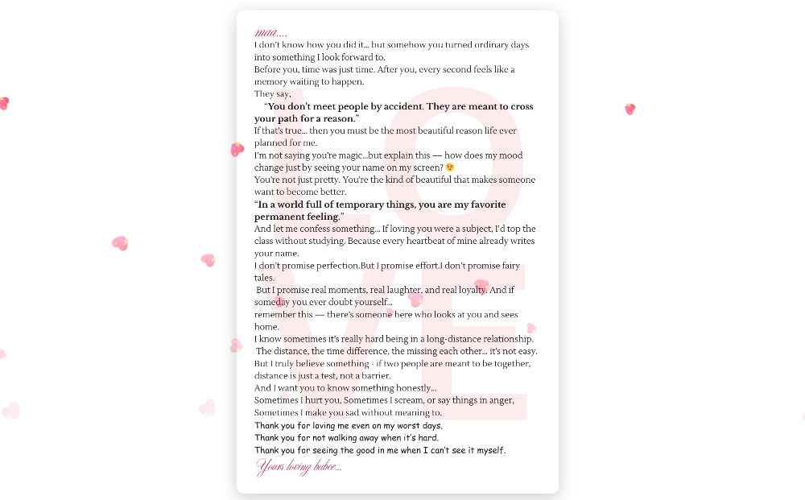

# 💖 Valentine Special Web App

A romantic and interactive Valentine-themed web application built with ❤️ using modern frontend technologies.  
This project includes animations, love letters, heart effects.

---
### View live
Open this link to view project
```
https://abhishekgorinta.github.io/valentines-card/
```
##  Features

- 💌 Romantic Love Letter Page (Flirty & Emotional)
- 💖 Floating Hearts Animation from Bottom
- 🎨 Beautiful Pink Shadow Cards
- ✨ Smooth CSS Animations & Transitions
- 📱 Fully Responsive Design

---
## 📸 Screenshots



---
## 🛠️ Technologies Used

- HTML5
- CSS3 (Animations, Shadows, Effects)
- JavaScript

---

## 📂 Project Structure
```
valentine/
│
├── index.html
├── card.html
│── style.css
│── letter.html
├── js/
│ └── script.js
├── assets/
│ ├── images.png
│ 
└── README.md
```

---

## 🚀 How to Run the Project
1️⃣ Clone the repository:

```bash
https://github.com/abhishekgorinta/valentines-card.git
```

## 👨‍💻 Author
### Developed by Abhishek Gorinta
Aspiring Web Developer

## License:
This project is free to use and modify for learning purposes.

⭐ If you like this project, don't forget to give it a star on GitHub!

